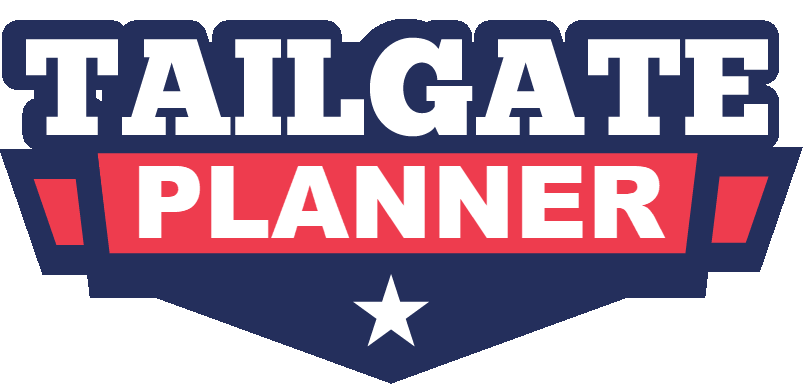

# tailgate-planner

<!-- ABOUT THE PROJECT -->
## About The Project
 

Our second project in the bootcamp, this time we are creating an application backed by a MySQL database with A Sequelize ORM an

(<a href="#top">back to top</a>)

### Built With

<!-- This section should list any major frameworks/libraries used to bootstrap your project. Leave any add-ons/plugins for the acknowledgements section. Here are a few examples. -->

* [HTML](https://en.wikipedia.org/wiki/HTML)
* [CSS](https://en.wikipedia.org/wiki/CSS)
* [Font Awesome v5.8.1](https://fontawesome.com/)
* [JS](https://www.javascript.com/)
* [JQuery v3.2.1](https://jquery.com/)
* [Animate.css](https://animate.style/)

(<a href="#top">back to top</a>)

<!-- GETTING STARTED -->

## Members and Roles:

* Albert Bautista (developer)
* Aumio Aziz (developer)

 

## Project Name: Tailgate Planner
* Github: [Repo](https://github.com/tailgate-power-of-two/tailgate-planner)
* Wireframe: [Whimsical](https://whimsical.com/project-2-P8R4BwNv2jFTGyHaWdkNZJ)
* Presentation: [Presentation](https://docs.google.com/presentation/d/1inoMDdrnHkAAAT6nmM9achjA9i3IKe5-SdcWKq3O7E4/edit?usp=sharing)
* Heroku: [Heroku Deployment](https://tailgate-planner-app.herokuapp.com/)

 
 

## The Pitch:

Do you attend tailgate parites?
Are you a fan of organization?

Well look no further, our Tailgate Planner App is just what you’re looking for!!

 

## Commitments as a project team:

  * Keep other team members informed and transfer knowledge to others when applicable.
  * Focus on what is best for the project as a whole.
  * Give everyone the opportunity for equal participation (draw out introverts and balance extroverts).
  * Be open to new approaches and listen to new ideas.
  * Get input from the entire team before a decision is made. If this isn’t feasible, at least get input from key people.
  * Attack problems or issues – not the person. When at a roadblock, console.log(math.random…)

 

## Things to Consider (If time allows):
 

 

<!-- USAGE EXAMPLES -->
## Usage

<!-- _For more examples, please refer to the [Documentation](https://example.com)_ -->

(<a href="#top">back to top</a>)

<!-- ROADMAP -->
## Roadmap

- [x] Initialize readme
- [x] Add Working Agreement
- [ ] Add Additional Templates w/ Examples
- [ ] Add "components" document to easily copy & paste sections of the readme

See the [open issues](https://github.com/tailgate-power-of-two/tailgate-planner/issues) for a full list of proposed features (and known issues).

(<a href="#top">back to top</a>)

## Contact

Project Team: [https://github.com/tailgate-power-of-two/](https://github.com/tailgate-power-of-two/)
* Albert Bautista (developer) - https://github.com/devilarms83
* Aumio Aziz (developer) - https://github.com/aescobar73 

Project Link: [https://github.com/tailgate-power-of-two/tailgate-planner](https://github.com/tailgate-power-of-two/tailgate-planner)

(<a href="#top">back to top</a>)

<!-- ACKNOWLEDGMENTS -->
## Acknowledgments

* [Font Awesome](https://fontawesome.com)
* [DiceBear Avatars](https://avatars.dicebear.com/)
* [flatpickr](https://flatpickr.js.org/)

(<a href="#top">back to top</a>)

